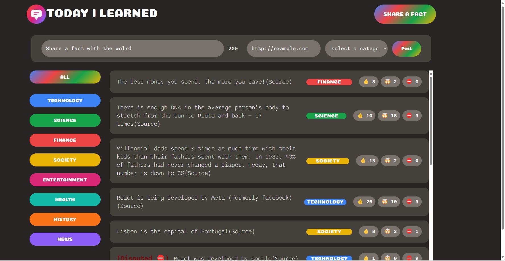

# Project Name: Today I learnt

Project introduction: This project is a simple fullstack application that allows users to create, read, update.
                      The purpose of the building this project is to apply the react knowledge and further enhance the development skill of web development.

## Technologies Applied

- React
- Tailwindcss / CSS3 (responsive design)
- Supabase (Database)

## Approach of handle the project

- Create a new project with VITE framework
- Design the static display for the different screens(By tailwindcss and CSS3)
- Create the backend API with Supabase
- Connect the backend API with frontend application
- Testing the application and verify the functionalities.
- Deploy the application to Netlify
- Document the project with Readme file
- CI/CD for the application

## Chanlleng Faced

The biggest challenge I faced was to connect the backend API with frontend application.
I need to spend some time to understand the Supabase API and how to use it to connect with the frontend application.
Another challenge I faced was to design the responsive UI with Tailwindcss and CSS3.

Through this project, I have further enhance the skills of apply Tailwindcss and CSS3 to design the responsive UI.

## Future Development

- Add more features to the application,such as the user authentication and authorization,sorting and filtering the data
- Add the function that user only can vote the fact once

- Improve the UI and UX of the application

## App Link

The application is deployed to Netlify, you can access it here: [//today-i-learnt](https://todayilearntjames.netlify.app/)